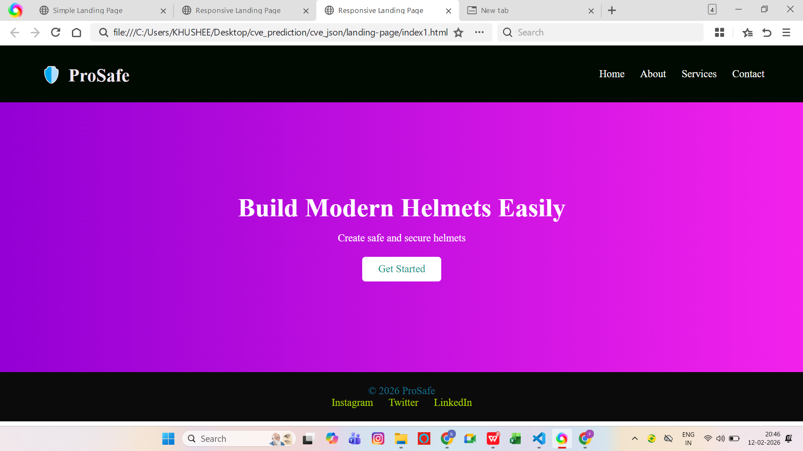
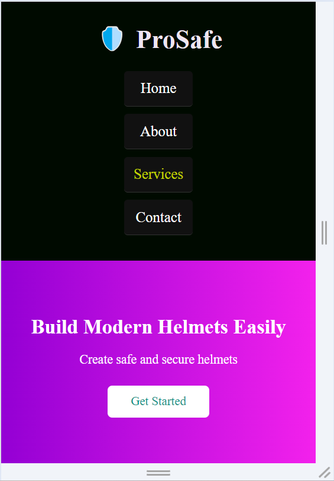

-> Responsive Landing Page (Mobile-Friendly)

-> Project Overview
This project converts a desktop-only landing page into a mobile-friendly responsive layout using CSS media queries. The layout adapts automatically to different screen sizes, improving usability on mobile devices.

-> Objective
To implement responsive design techniques using CSS media queries so the webpage works smoothly on desktop, tablet, and mobile screens.

->Tools Used
* HTML5
* CSS3
* VS Code
* Chrome DevTools

->Features
* Responsive header navigation
* Mobile-friendly stacked layout
* Scalable images
* Optimized spacing for small screens
* Improved readability on mobile
* No horizontal scrolling

-->Screenshots
 Desktop View

 Mobile View

-> Responsive Behavior
When screen width is "768px or smaller":
* Navigation links stack vertically
* Header layout adjusts
* Hero section padding reduces
* Font sizes scale for readability

-> Project Structure
project-folder
│
├── index.html
├── style.css
└── README.md

-> How to Run
1. Download or clone the repository
2. Open `index.html` in any browser
3. Resize the browser or use Chrome DevTools mobile view

-> Outcome
The website adapts dynamically to mobile screens, ensuring a clean and user-friendly interface.This project demonstrates basic responsive web design using CSS media queries.
